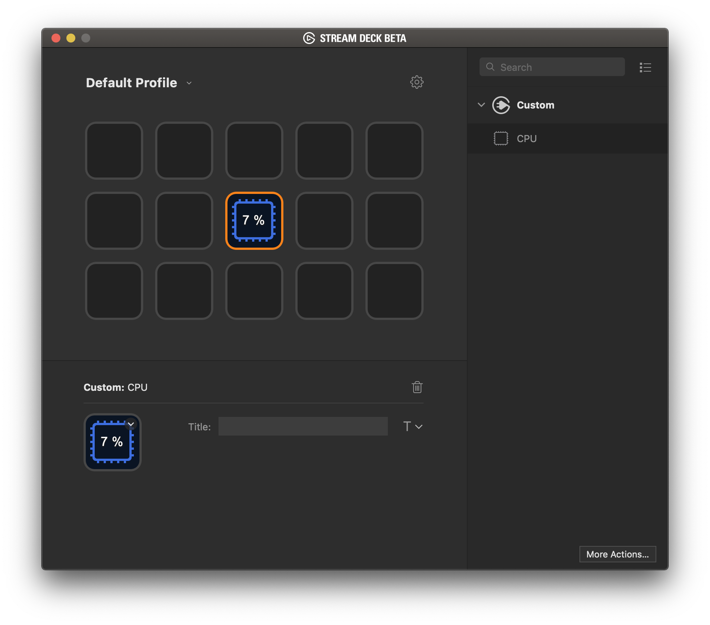

`CPU` is a sample plugin demonstrating the [Stream Deck SDK](https://developer.elgato.com/documentation/stream-deck/).

This fork demonstrates [FredEmmott/StreamDeckCPPSDK](https://github.com/fredemmott/streamdeck-cpu/), and porting to it.

# Description

`CPU` is a plugin that displays the CPU usage on a key.

# Features

- code written in C++
- cross-platform (macOS, Windows)
- localized

# Source code

The Sources folder contains the source code of the plugin.
